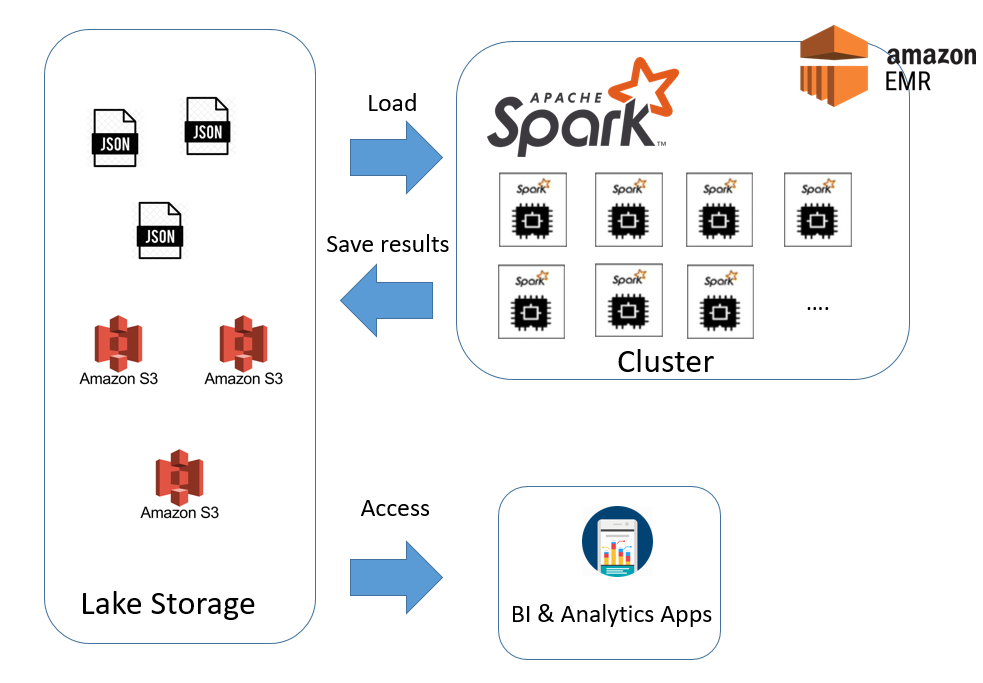

# Welcome to my Data modeling and Postgresql ETL mini-project!

## In this repo, we will work with Spark to build an ETL pipeline for a data lake hosted on S3 (or localy) for the start-up Sparkify. 

## What is Spakrify?

#### """Sparkify is a start-up that wants to analyze the data they've been collecting on songs and user activity on their new music streaming app. The analytics team is particularly interested in understanding what songs users are listening to. Currently, they don't have an easy way to query their data, which resides in a directory of JSON logs on user activity on the app, as well as a directory with JSON metadata on the songs in their app."""

#### So you will ask....
#### Ok Antonis, how do I create the database from the pipeline?

#### Well its easy!
##### 1) In case that you want to run localy the pipeline. Go to 2) Else, if you want to include AWS go to 1*) 
##### 1*) add your AWS_ACCESS_KEY_ID and AWS_SECRET_ACCESS_KEY. And also, input_data and output_data in the etl.py
##### 2) run the ETL.py

 
### Code Description:

dll.cfg contains the AWS info needed to load and save the data as well for the EMR connection.

etl.py loads the json data from the S3 bucket (or localy), and using sparkify it then creates the star schema database that is either saved back on S3 or localy using spark.

data folder contains the data to be loaded and to be partitioned in case you run this localy.

## Check out the ETL sketch of the project

